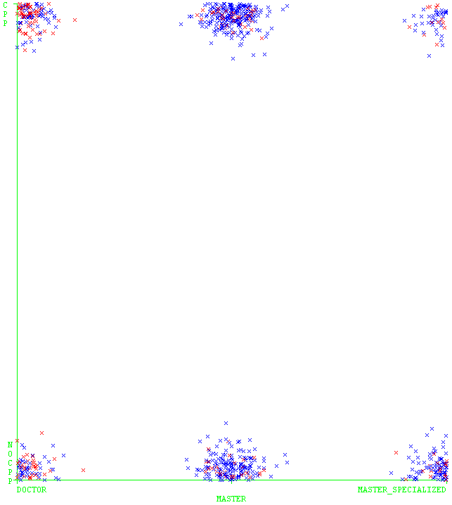
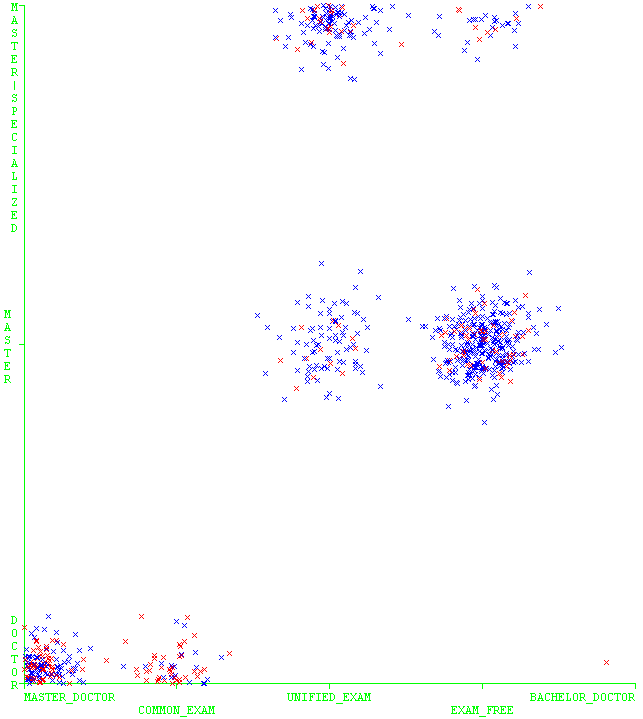

# 基于weka的分类算法研究报告

数据:802_ENGLISH_XLS1.csv

## Preprocess

先不考虑TID,SID

credit 数据存在问题

## clusterer first

做聚类分析后影响分类的主要因素为

1. recurting way
1. stype
1. sage_in
1. sage_out
1. delay_year

所以,最明显的结果就是,毕业延迟与博硕,招生方式,入学时间有极大关联......

对于employment_unit_class影响不大......

credit 数据存在问题

## 手工分析 (使用trees.UserClassifier)

employment_unit_class与以下属性存在强相关(不存在的)

唯一比较明显的的特征:





## 选择属性 (或使用AttributeSelectedClassifier)

```
weka.attributeSelection.CfsSubsetEval -P 1 -E 1

Selected attributes: 1,2,3,12,20,21,33,34 : 8
                     YEAR_IN
                     RECRUITING_WAY
                     STYPE
                     SAGE_OUT
                     CREDIT
                     GPA
                     DALEY_YEAR
                     DELAY
```

## 使用CVParameterSelection调整参数

## 分类算法 

参见袁梅宇. 数据挖掘与机器学习:WEKA应用技术与实践 (Kindle 位置 1508-1509). 清华大学出版社. Kindle 版本. 8379.

Weka的分类算法按照其功能分为如下七种：bayes(贝叶斯) functions(功能)、lazy(消极),meta(元),misc(杂项),rules(规则) 和trees(树)。

袁梅宇. 数据挖掘与机器学习:WEKA应用技术与实践 (Kindle 位置 8395-8396). 清华大学出版社. Kindle 版本. 

## 不同分类算法的比较(meta,misc算法除外)

用experimenter功能实现以提高效率

全部采用默认参数

|分类算法|ned-ned|ed-ned|ned-ed|ed-ed|edTP|nedTP|注记|
|-|-|-|-|-|-|-|-|
|贝叶斯|504|97|102|99|0.492537313|0.838602329||所有数据基于全部属性
|朴素贝叶斯|515|86|117|84|0.417910448|0.856905158||所有验证采用10fold验证
|逻辑斯蒂回归|522|49|142|59|0.293532338|0.914185639|我觉得functions里的都比较悬|
|反向传播|492|109|124|77|0.383084577|0.818635607|"很慢很慢|忘了它吧"|
|SGD随机梯度下降|568|33|157|44|0.218905473|0.945091514|"nedTP很高|但edTP很低似乎没什么卵用"|
|简单逻辑斯蒂|565|36|151|50|0.248756219|0.940099834||
|SMO序列最小优化算法|582|19|163|38|0.189054726|0.968386023||
|ibk k最近邻分类器|466|135|135|66|0.328358209|0.775374376||
|kstar|483|118|136|65|0.323383085|0.803660566|稍慢|
|lwl局部加权学习|556|45|149|52|0.258706468|0.925124792||
|InputMappedClassifier|||||#DIV/0!|#DIV/0!||
|DecisionTable|551|50|146|55|0.273631841|0.916805324||
|Jrip|541|60|131|70|0.348258706|0.900166389||
|OneR|545|56|171|30|0.149253731|0.906821963|kappa过低不考虑|
|PART|471|130|126|75|0.373134328|0.783693844||
|ZEROR|||||#DIV/0!|#DIV/0!||
|决策树桩|522|79|128|73|0.36318408|0.868552413||
|J48 C4.5决策树|534|67|139|62|0.308457711|0.888519135||
|LMT逻辑斯蒂模型树|565|36|151|50|0.248756219|0.940099834||
|随机森林|560|41|143|58|0.288557214|0.931780366||
|随机树|460|141|136|65|0.323383085|0.765391015|kappa过低不考虑|
|REP树|544|57|147|||0.90515807||

meta算法中用贝叶斯和J48,决策树桩考虑

## 元分类算法分析

使用AttributeSelectedClassifier可能提高效果(先进行相关属性选择)

通过CVParameterSelection来调整参数(试参数时用)

AdaboostM1(标称数据),AddictiveRegression:用一种方法迭代提高准确率

Bagging(降方差)

MultiScheme:从多种方法中选择

## 表现(相对)良好的几种算法

### 贝叶斯

```
=== Run information ===

Scheme:       weka.classifiers.bayes.BayesNet -D -Q weka.classifiers.bayes.net.search.local.K2 -- -P 1 -S BAYES -E weka.classifiers.bayes.net.estimate.SimpleEstimator -- -A 0.5
Relation:     802_ENGLISH_XLS1re
Instances:    802
Attributes:   34
......

Test mode:    10-fold cross-validation

=== Classifier model (full training set) ===

Bayes Network Classifier
not using ADTree
#attributes=34 #classindex=31
Network structure (nodes followed by parents)
YEAR_IN(1): EMPLOYMENT_UNIT_CLASS 
RECRUITING_WAY(5): EMPLOYMENT_UNIT_CLASS 
STYPE(3): EMPLOYMENT_UNIT_CLASS 
MAJOR(6): EMPLOYMENT_UNIT_CLASS 
NATION(2): EMPLOYMENT_UNIT_CLASS 
SEX(2): EMPLOYMENT_UNIT_CLASS 
SAGE_IN(2): EMPLOYMENT_UNIT_CLASS 
CPP_MEMBER(2): EMPLOYMENT_UNIT_CLASS 
INTERVIEW_SCORE_01(1): EMPLOYMENT_UNIT_CLASS 
INTERVIEW_SCORE_CLASS(4): EMPLOYMENT_UNIT_CLASS 
985_211(3): EMPLOYMENT_UNIT_CLASS 
SAGE_OUT(2): EMPLOYMENT_UNIT_CLASS 
CONTINUOUS_EDUCATION(2): EMPLOYMENT_UNIT_CLASS 
CHANGE_MAJOR(2): EMPLOYMENT_UNIT_CLASS 
TAGE_SIN(1): EMPLOYMENT_UNIT_CLASS 
TCPP_MEMBER(2): EMPLOYMENT_UNIT_CLASS 
TTITLE(3): EMPLOYMENT_UNIT_CLASS 
TDUTY(2): EMPLOYMENT_UNIT_CLASS 
EXPERT(2): EMPLOYMENT_UNIT_CLASS 
CREDIT(3): EMPLOYMENT_UNIT_CLASS 
GPA(2): EMPLOYMENT_UNIT_CLASS 
GPA_CLASS(4): EMPLOYMENT_UNIT_CLASS 
GPA_01(1): EMPLOYMENT_UNIT_CLASS 
GPA_MAIN(1): EMPLOYMENT_UNIT_CLASS 
GPA_CLASS_MAIN(4): EMPLOYMENT_UNIT_CLASS 
GPA_MAIN_01(1): EMPLOYMENT_UNIT_CLASS 
PROPOSAL_GRADE(3): EMPLOYMENT_UNIT_CLASS 
MID_GRADE(3): EMPLOYMENT_UNIT_CLASS 
JUDGING_GRADE(2): EMPLOYMENT_UNIT_CLASS 
ANSWERING_GRADE(2): EMPLOYMENT_UNIT_CLASS 
TIME_TO_PROPOSAL(1): EMPLOYMENT_UNIT_CLASS 
EMPLOYMENT_UNIT_CLASS(2): 
DALEY_YEAR(2): EMPLOYMENT_UNIT_CLASS 
DELAY(2): EMPLOYMENT_UNIT_CLASS 
LogScore Bayes: -16390.47907741949
LogScore BDeu: -16519.331041720074
LogScore MDL: -16528.285518975586
LogScore ENTROPY: -16224.02207731766
LogScore AIC: -16315.02207731766


Time taken to build model: 0 seconds

=== Stratified cross-validation ===
=== Summary ===

Correctly Classified Instances         603               75.187  %
Incorrectly Classified Instances       199               24.813  %
Kappa statistic                          0.3339
Mean absolute error                      0.2683
Root mean squared error                  0.4803
Relative absolute error                 71.3496 %
Root relative squared error            110.8278 %
Total Number of Instances              802     

=== Detailed Accuracy By Class ===

                 TP Rate  FP Rate  Precision  Recall   F-Measure  MCC      ROC Area  PRC Area  Class
                 0.839    0.507    0.832      0.839    0.835      0.334    0.672     0.822     NO_EDUCATION_RESEARCH
                 0.493    0.161    0.505      0.493    0.499      0.334    0.672     0.439     EDUCATION_RESEARCH
Weighted Avg.    0.752    0.421    0.750      0.752    0.751      0.334    0.672     0.726     

=== Confusion Matrix ===

   a   b   <-- classified as
 504  97 |   a = NO_EDUCATION_RESEARCH
 102  99 |   b = EDUCATION_RESEARCH

```

*但是......贝叶斯的结果真的要多简洁有多简洁/滑稽*

### weka.classifiers.trees.J48 -C 0.25 -M 2

> 这是此分类器默认的参数设置， 对于J48分类器，很少需要为获得良好的性能而更改这些参数。
> 袁梅宇. 数据挖掘与机器学习:WEKA应用技术与实践 (Kindle 位置 1508-1509). 清华大学出版社. Kindle 版本. 

* 对于从事教育相关的阳性率达到50%,且假阳性率极低仅为3.2%
* 进行人工集成学习?

* re: cross-v之后只剩30%,10%了......还是不靠谱

实际上,调整到-C 0.1 -M 10效果会好一些

```

=== Run information ===

Scheme:       weka.classifiers.trees.J48 -C 0.25 -M 2
Relation:     802_ENGLISH_XLS1
Instances:    802


=== Summary ===

Correctly Classified Instances         694               86.5337 %
Incorrectly Classified Instances       108               13.4663 %
Kappa statistic                          0.5945
Mean absolute error                      0.2201
Root mean squared error                  0.3318
Relative absolute error                 58.559  %
Root relative squared error             76.5553 %
Total Number of Instances              802     

=== Detailed Accuracy By Class ===

                 TP Rate  FP Rate  Precision  Recall   F-Measure  MCC      ROC Area  PRC Area  Class
                 0.968    0.443    0.867      0.968    0.915      0.616    0.819     0.903     NO_EDUCATION_RESEARCH
                 0.557    0.032    0.855      0.557    0.675      0.616    0.819     0.698     EDUCATION_RESEARCH
Weighted Avg.    0.865    0.340    0.864      0.865    0.855      0.616    0.819     0.852     

=== Confusion Matrix ===

   a   b   <-- classified as
 582  19 |   a = NO_EDUCATION_RESEARCH
  89 112 |   b = EDUCATION_RESEARCH

```

### weka.classifiers.trees.DecisionStump

数据很好看,但是看下结果就发现......不太靠谱

```
=== Run information ===

Scheme:       weka.classifiers.trees.DecisionStump 
Relation:     802_ENGLISH_XLS1re
Instances:    802
Attributes:   34
             
Test mode:    10-fold cross-validation

=== Classifier model (full training set) ===

Decision Stump

Classifications

STYPE = DOCTOR : EDUCATION_RESEARCH
STYPE != DOCTOR : NO_EDUCATION_RESEARCH
STYPE is missing : NO_EDUCATION_RESEARCH

Class distributions

STYPE = DOCTOR
NO_EDUCATION_RESEARCH	EDUCATION_RESEARCH	
0.49246231155778897	0.507537688442211	
STYPE != DOCTOR
NO_EDUCATION_RESEARCH	EDUCATION_RESEARCH	
0.8341625207296849	0.16583747927031509	
STYPE is missing
NO_EDUCATION_RESEARCH	EDUCATION_RESEARCH	
0.7493765586034913	0.2506234413965087	


Time taken to build model: 0 seconds

=== Stratified cross-validation ===
=== Summary ===

Correctly Classified Instances         595               74.1895 %
Incorrectly Classified Instances       207               25.8105 %
Kappa statistic                          0.2522
Mean absolute error                      0.3325
Root mean squared error                  0.4081
Relative absolute error                 88.4299 %
Root relative squared error             94.1648 %
Total Number of Instances              802     

=== Detailed Accuracy By Class ===

                 TP Rate  FP Rate  Precision  Recall   F-Measure  MCC      ROC Area  PRC Area  Class
                 0.869    0.637    0.803      0.869    0.835      0.256    0.639     0.809     NO_EDUCATION_RESEARCH
                 0.363    0.131    0.480      0.363    0.414      0.256    0.639     0.375     EDUCATION_RESEARCH
Weighted Avg.    0.742    0.510    0.722      0.742    0.729      0.256    0.639     0.700     

=== Confusion Matrix ===

   a   b   <-- classified as
 522  79 |   a = NO_EDUCATION_RESEARCH
 128  73 |   b = EDUCATION_RESEARCH

```
### meta大杂烩 

```
weka.classifiers.meta.Vote -S 1 -B "weka.classifiers.bayes.BayesNet -D -Q weka.classifiers.bayes.net.search.local.K2 -- -P 1 -S BAYES -E weka.classifiers.bayes.net.estimate.SimpleEstimator -- -A 0.5" -B "weka.classifiers.bayes.NaiveBayes " -B "weka.classifiers.trees.DecisionStump " -B "weka.classifiers.trees.J48 -C 0.25 -M 2" -R AVG
```

```
Time taken to build model: 0.02 seconds

=== Stratified cross-validation ===
=== Summary ===

Correctly Classified Instances         608               75.8105 %
Incorrectly Classified Instances       194               24.1895 %
Kappa statistic                          0.3294
Mean absolute error                      0.2948
Root mean squared error                  0.4258
Relative absolute error                 78.4196 %
Root relative squared error             98.2609 %
Total Number of Instances              802     

=== Detailed Accuracy By Class ===

                 TP Rate  FP Rate  Precision  Recall   F-Measure  MCC      ROC Area  PRC Area  Class
                 0.859    0.542    0.826      0.859    0.842      0.331    0.668     0.820     NO_EDUCATION_RESEARCH
                 0.458    0.141    0.520      0.458    0.487      0.331    0.668     0.457     EDUCATION_RESEARCH
Weighted Avg.    0.758    0.442    0.749      0.758    0.753      0.331    0.668     0.729     

=== Confusion Matrix ===

   a   b   <-- classified as
 516  85 |   a = NO_EDUCATION_RESEARCH
 109  92 |   b = EDUCATION_RESEARCH

```

但是,主要的影响因素还是Doctor/not

## Tree的进一步讨论

J48 参见 <http://www.cnblogs.com/chamie/p/4523976.html>,基于信息增益构建树. 效果拔群,参数简单,而且便于解释.

decision stump 一刀切\单层决策树

<http://blog.csdn.net/lanchunhui/article/details/50980635>

随机森林 参见 <http://www.cnblogs.com/hrlnw/p/3850459.html>